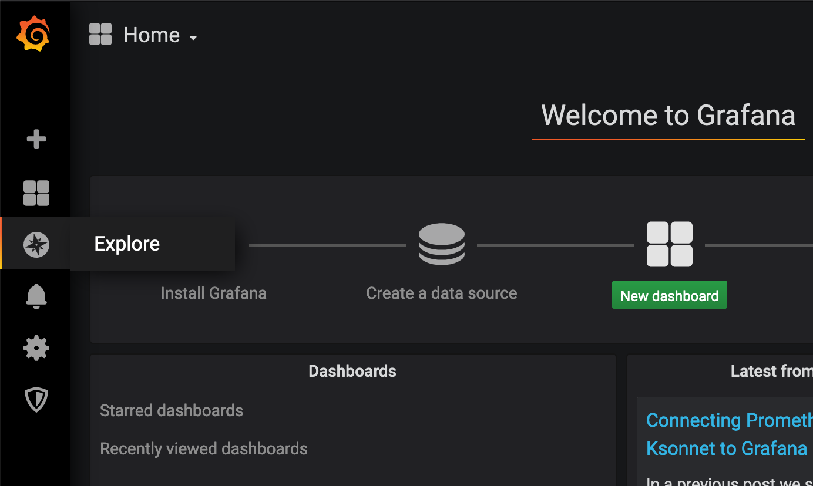
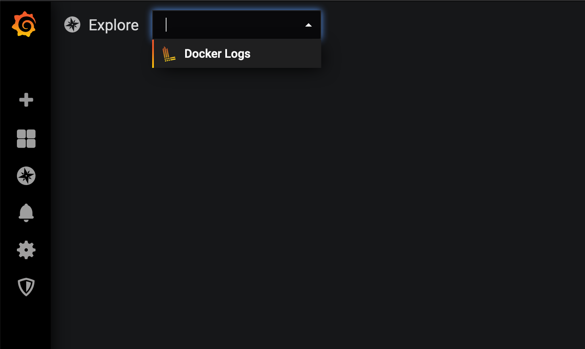
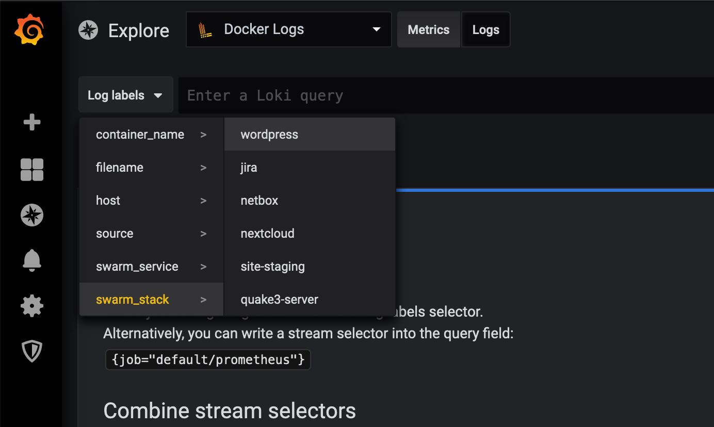

# Grafana Setup for Planetary Quantum

https://www.planetary-quantum.com/

This starts up a Grafana on your Quantum cluster, to view your docker logs.

## Deploy

You'll need [`quantum-cli`](https://cli.planetary-quantum.com/).

* `cp docker-compose.example.yml docker-compose.yml`, and edit it:
    * set the `traefik.frontend.rule` label to include the hostname of your endpoint/cluster (or your custom domain, if you want that)
    * set `INITIAL_ADMIN_PASSWORD` to something random
    * set `QUANTUM_ENDPOINT` to the name of your endpoint/cluster
* then:
    ```
    $ QUANTUM_ENDPOINT=your-cluster-name
    $ quantum-cli stack update --create --wait --stack "grafana-$QUANTUM_ENDPOINT"
    ```

## Basic usage

* on the left-hand side menu choose "Explore"
  
* select "Docker Logs" at the top, and click on "Logs" right next to it
  
* select some log label via the drop-down next to the search bar
  
* you should now see your logs
